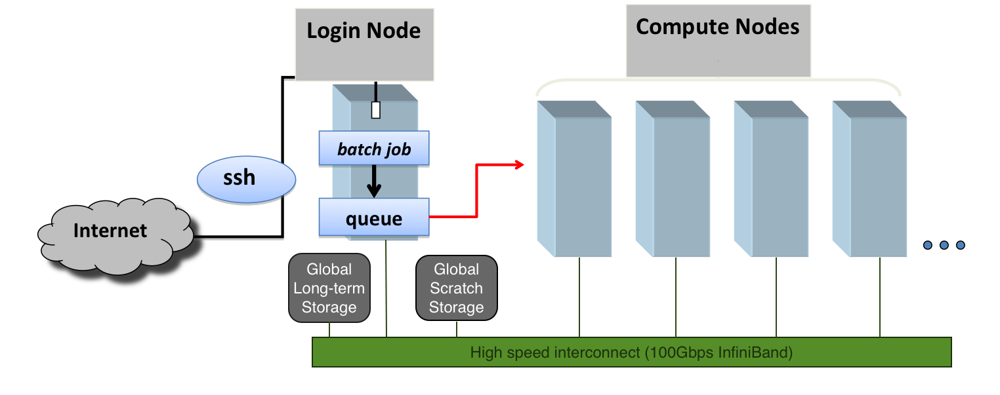

# Introduction

## About HPC at CofC

High performance computing \(HPC\) at College of Charleston has historically been under the purview of the Department of Computer Science. It is now under the Division of Information Technology with the aim of delivering a research computing environment and support for the whole campus. We especially thank the following groups for making HPC at CofC possible.

* [Office of the President](http://president.cofc.edu/about/index.php)
* [Division of Information Technology](http://it.cofc.edu)
* [School of Sciences and Mathematics](http://ssm.cofc.edu)

## HPC Cluster Specs in Brief

We recently purchased a new Linux cluster that has been in full operation since late April 2019. Faculty and staff can request accounts by emailing [hpc@cofc.edu](mailto:hpc@cofc.edu) or filling out a [service request](https://cofc.teamdynamix.com/TDClient/Requests/ServiceDet?ID=35085). Students are eligible for accounts upon endorsement or sponsorship by their faculty/staff mentor.

The HPC is a commodity Linux cluster containing many compute, storage and networking equipment all assembled into a standard rack. It is largely accessed remotely via SSH although some applications can be accessed using web interfaces and remote desktop tools.  

The specs for the cluster are provided below.

* [**Compute nodes**](overview/hardware.md)
  * 10 standard compute nodes:
    * 2x 20-core 2.4GHz Intel Xeon Gold 6148 CPUs w/ 27MB L3 cache,
    * 192GB of DDR4 2667MHz RAM,
    * 1x 480GB of local SSD storage,
    * Double precision performance ~ 2.8 TFLOPs/node
  * 1 large memory node:
    * 4x 20-core 2.4GHz Intel Xeon Gold 6148 CPUs w/ 27MB L3 cache,
    * 1536GB of DDR4 2667MHz RAM,
    * 2x 480GB of local SSD storage,
    * Double precision performance ~ 5.6 TFLOPs/node
  * 2 GPU-containing nodes:
    * 2x 12-core 2.6GHz Intel Xeon Gold 6126 CPUs w/ 19MB L3 cache,
    * 192GB of DDR4 2667MHz RAM,
    * 480GB of local SSD storage,
    * 1 NVIDIA Tesla V100 16GB GPU
    * Double precision performance ~ 1.8 + 7.0 = 8.8 TFLOPs/node
* [**Login/visualization node**](overview/hardware.md)
  * 1 login and visualization node:
    * 2x 12-core 2.6GHz Intel Xeon Gold 6126 CPUs w/ 27MB L3 cache,
    * 192GB of DDR4 2667MHz RAM,
    * 3TB of local apps storage,
    * 1x NVIDIA Quadro P4000 8GB GPU
* [**Storage**](overview/storage.md)
  * 512TB NFS-shared, global, highly-available storage
  * 38TB NFS-shared, global fast NVMe-SSD-based scratch storage
  * 300-600GB local SSDs in each compute node for local scratch storage
* [**Interconnect**](http://www.mellanox.com/page/products_dyn?product_family=192&mtag=sb7700_sb7790)
  * Mellanox EDR Infiniband with 100Gb/s bandwidth
* [**Software stack**](overview/software.md)
  * OpenHPC 1.3.6
  * CentOS 7.6
  * Warewulf provisioning
  * SLURM scheduler
  * LMod modules for package management
  * Workflow tools

In total, the cluster has a theoretical peak performance of 51 trillion floating point operations per second \(TeraFLOPS\). We will provide benchmarks based on standard High Performance LINPACK \(HPL\) at some point.

## Support and Facilitation

If you need any help, please follow any of the following channels.

* Submit a support ticket through [TeamDynamix](https://cofc.teamdynamix.com)
  * [Service requests](https://cofc.teamdynamix.com/TDClient/Requests/ServiceDet?ID=35085). These include inquiries about accounts, projects and services
    * Request account
    * Seek consultation about teaching/research projects
    * Inquire about operations
    * Ask about documentation
  * [Incident requests](https://cofc.teamdynamix.com/TDClient/Requests/ServiceDet?ID=35086). These include any problems you encounter during any HPC operations
    * Inability to access the cluster or individual nodes
    * Inability to run calculations
    * Inability to access data
* If TeamDynamix is inaccessible, please email [HPC support](mailto:hpc@cofc.edu) directly or
* Email the campus [helpdesk](mailto:helpdesk@cofc.edu) or
* Call the campus helpdesk at 853-953-3375 during these hours
  * Mon - Fri 7:30 AM - 10:00 PM
  * Sat - Sun 2:00 PM - 10:00 PM
* Stop by Bell Building, Room 520 during normal work hours \(M-F, 8AM-5PM\)

We recognize that there are a lot of hurdles that keep people from using HPC resources. We have experience facilitating research computing for experts and new users alike. So, please feel free to contact us and we will work to get you started.

## Acknowledgements for this Guide

Big thanks to Wendi Sapp \(Oak Ridge National Lab \(ORNL\) [CADES](https://cades.ornl.gov/), [Sustainable Horizons Institute](http://shinstitute.org/wendi-sapp-3/), [USD Research Computing Group](http://rcg.usd.edu)\) and the team at ORNL for sharing the template for this documentation with the HPC community. You can find Wendi's original documentation on [GitHub](https://github.com/wendikristine/documentation-template)

