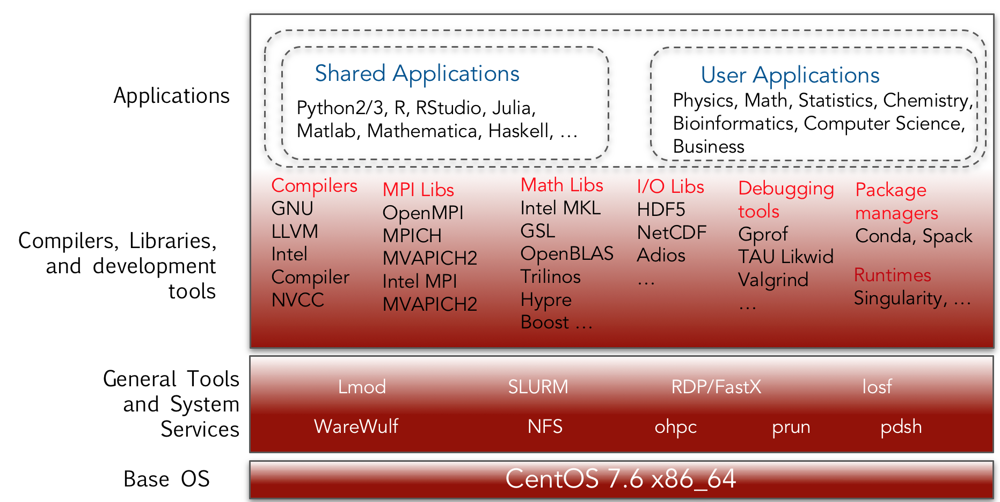

# Software

## OpenHPC Stack

The cluster runs [OpenHPC stack](https://openhpc.community/) on top of a CentOS 7.6 operating system.


The OpenHPC software stack looks like this:




<table>
  <thead>
    <tr>
      <th style="text-align:center">Category</th>
      <th style="text-align:left">Component</th>
    </tr>
  </thead>
  <tbody>
    <tr>
      <td style="text-align:center"><b>Base OS</b>
      </td>
      <td style="text-align:left">CentOS 7.6 x86_64</td>
    </tr>
    <tr>
      <td style="text-align:center"><b>Compilers</b>
      </td>
      <td style="text-align:left">
        <p>GNU8.5 (gcc, g++, gfortran),</p>
        <p>GNU7.3 (gcc, g++, gfortran),</p>
        <p>GNU5.4 (gcc, g++, gfortran),</p>
        <p>GNU4.8.5 (gcc, g++, gfortran),</p>
        <p>Intel 2019</p>
      </td>
    </tr>
    <tr>
      <td style="text-align:center"><b>MPI libraries</b>
      </td>
      <td style="text-align:left">OpenMPI, MPICH, MPICH2, MVAPICH2, Intel MPI (IMPI)</td>
    </tr>
    <tr>
      <td style="text-align:center"><b>Software provisioner</b>
      </td>
      <td style="text-align:left">Lmod</td>
    </tr>
    <tr>
      <td style="text-align:center"><b>Resource manager</b>
      </td>
      <td style="text-align:left">SLURM, Munge</td>
    </tr>
    <tr>
      <td style="text-align:center"><b>Math/Numerical Libraries</b>
      </td>
      <td style="text-align:left">BLAS, LAPACK, OpenBLAS, ATLAS, MKL, Scalapack, Boost, GSL, FFTW, Hypre,
        PETSc, SuperLU, Trilinos</td>
    </tr>
    <tr>
      <td style="text-align:center"><b>MPI libraries</b>
      </td>
      <td style="text-align:left">OpenMPI, MPICH, MPICH2, MVAPICH, IMPI</td>
    </tr>
    <tr>
      <td style="text-align:center"><b>I/O libraries</b>
      </td>
      <td style="text-align:left">HDF5(pHDF), NetCDF, Adios</td>
    </tr>
    <tr>
      <td style="text-align:center"><b>Development tools</b>
      </td>
      <td style="text-align:left">Autotools (autoconf, automake, libtool), Valgrind</td>
    </tr>
    <tr>
      <td style="text-align:center"><b>Debugging and profiling tools</b>
      </td>
      <td style="text-align:left">Gprof, TAU, Likwid, Dimemas</td>
    </tr>
  </tbody>
</table>Some of the underlying management components are:

|  | Available component |
| :---: | :--- |
| Node provisioning | Warewulf |
| Resource management | SLURM |
| Software provisioning | Lmod modules, built using Lmod/easybuild/Spack |
| Cluster monitoring | Ganglia, Nagios |

## Application Access

A wide range of software from specific disciplines as well as general ones \(Python, R, C, C++\) will be pre-compiled and provisioned as `modules` users can load at run time. If there is a particular software users want to use, please submit a request to have them installed in a central location. Otherwise, users can install them in their own area for their personal use. If users prefer working with containers, we encourage using `Singularity` containers which are preferred over `Docker` for HPC applications.

### Provisioning Software Using Modules

Our software environment uses LMod [modules](../using-the-hpc/modules/) to set paths to executables, libraries, include files and manual pages for the installed software. The software modules available to users are organized according to the compiler and MPI library to ensure that the environment is set up properly to run the applications.  


The HPC software environment uses Linux environment modules to manage versions and dependencies of software packages. When you load a module, it sets the environment variables necessary for running your program.

A list of available software modules can be viewed by typing `module avail`.

A list of software modules that are currently loaded can be viewed by typing `module list`.

By default the local repository is used as a source of software installations.

Additional information on HPC modules may be found [here](../using-the-hpc/modules/).

## List of Applications

The list of applications available depends on the compiler and MPI libraries of choice. For the default GPU8 and OpenMPI3

### GNU8 + OpenMPI3

The default software has the following applications. More applications will be added upon request.

```bash
------------------------------ /opt/ohpc/pub/moduledeps/gnu8-openmpi3 -------------------------------
   adios/1.13.1     mpiP/3.4.1              pnetcdf/1.11.0      scorep/4.1
   boost/1.69.0     mumps/5.1.2             ptscotch/6.0.6      sionlib/1.7.2
   dimemas/5.3.4    netcdf-cxx/4.3.0        py2-mpi4py/3.0.0    slepc/3.10.2
   extrae/3.5.2     netcdf-fortran/4.4.5    py2-scipy/1.2.1     superlu_dist/6.1.1
   fftw/3.3.8       netcdf/4.6.2            py3-mpi4py/3.0.0    tau/2.28
   hypre/2.15.1     opencoarrays/2.2.0      py3-scipy/1.2.1     trilinos/12.12.1
   imb/2018.1       petsc/3.10.3            scalapack/2.0.2
   mfem/3.4         phdf5/1.10.4            scalasca/2.4

----------------------------------- /opt/ohpc/pub/moduledeps/gnu8 -----------------------------------
   R/3.5.2            likwid/4.3.3    mvapich2/2.3      openmpi3/3.1.3   (L)    py3-numpy/1.15.3
   hdf5/1.10.4        metis/5.1.0     ocr/1.0.1         pdtoolkit/3.25          superlu/5.2.1
   impi/2019.3.199    mpich/3.3       openblas/0.3.5    py2-numpy/1.15.3

------------------------------------- /opt/ohpc/pub/modulefiles -------------------------------------
   EasyBuild/3.7.1              cmake/3.12.2            papi/5.6.0
   autotools             (L)    cuda/9.2                pmix/2.1.4
   charliecloud/0.9.2           gnu7/7.3.0              prun/1.2          (L)
   chem/gamess/2018-R2          gnu8/8.3.0       (L)    singularity/2.6.0
   chem/gaussian/16-B.01        hwloc/1.11.10           use.own
   chem/mopac/2016              intel/19.0.3.199        valgrind/3.13.0
   chem/orca/4.1.2              llvm5/5.0.1
   clustershell/1.8             ohpc             (L)
```

### Intel + OpenMPI3

You can switch to from the default software stack build using GNU8 to one built using Intel compilers using modules: `module swap gnu8 intel`

The Intel 19 and OpenMPI3 software stack currently has the following packages.

```bash
------------------------------ /opt/ohpc/pub/moduledeps/intel-openmpi3 ------------------------------
   adios/1.13.1     mfem/3.4                pnetcdf/1.11.0      sionlib/1.7.2
   boost/1.69.0     mumps/5.1.2             ptscotch/6.0.6      slepc/3.10.2
   dimemas/5.3.4    netcdf-cxx/4.3.0        py2-mpi4py/3.0.0    superlu_dist/6.1.1
   extrae/3.5.2     netcdf-fortran/4.4.5    py3-mpi4py/3.0.0    tau/2.28
   geopm/0.6.1      netcdf/4.6.2            scalapack/2.0.2     trilinos/12.12.1
   hypre/2.15.1     petsc/3.10.3            scalasca/2.4
   imb/2018.1       phdf5/1.10.4            scorep/4.1

---------------------------------- /opt/ohpc/pub/moduledeps/intel -----------------------------------
   R/3.4.2            likwid/4.3.3    ocr/1.0.1             py2-numpy/1.15.3
   gdal/2.2.3         metis/5.1.0     openmpi3/3.1.3 (L)    py3-numpy/1.15.3
   hdf5/1.10.4        mpich/3.3       pdtoolkit/3.25        scotch/6.0.6
   impi/2019.3.199    mvapich2/2.3    plasma/2.8.0          superlu/5.2.1

------------------------------------- /opt/ohpc/pub/modulefiles -------------------------------------
   EasyBuild/3.7.1              chem/orca/4.1.2     hwloc/1.11.10           prun/1.2          (L)
   autotools             (L)    clustershell/1.8    intel/19.0.3.199 (L)    singularity/2.6.0
   charliecloud/0.9.2           cmake/3.12.2        llvm5/5.0.1             use.own
   chem/gamess/2018-R2          cuda/9.2            ohpc             (L)    valgrind/3.13.0
   chem/gaussian/16-B.01        gnu7/7.3.0          papi/5.6.0
   chem/mopac/2016              gnu8/8.3.0          pmix/2.1.4
```

### GNU7 + OpenMPI3

You can switch to from the default software stack build using GNU7 to one built using GNU7 using modules: `module swap gnu8 gnu7`

The GNU7 and OpenMPI3 software stack currently has the following packages.

```bash
----------------------------------- /opt/ohpc/pub/moduledeps/gnu7 -----------------------------------
   R/3.5.0    hdf5/1.10.2    mpich/3.2.1    mvapich2/2.2    openblas/0.2.20    openmpi3/3.1.0 (L)

------------------------------------- /opt/ohpc/pub/modulefiles -------------------------------------
   EasyBuild/3.7.1              cmake/3.12.2            papi/5.6.0
   autotools             (L)    cuda/9.2                pmix/2.1.4
   charliecloud/0.9.2           gnu7/7.3.0       (L)    prun/1.2          (L)
   chem/gamess/2018-R2          gnu8/8.3.0              singularity/2.6.0
   chem/gaussian/16-B.01        hwloc/1.11.10           use.own
   chem/mopac/2016              intel/19.0.3.199        valgrind/3.13.0
   chem/orca/4.1.2              llvm5/5.0.1
   clustershell/1.8             ohpc             (L)
```

### GNU + OpenMPI

If you have slightly older software that requires GNU5 compilers and OpenMPI1, you can switch from the default software stack build using GNU8 to one built using GNU5 using modules: `module swap gnu8 gnu`

The GNU and OpenMPI software stack currently has the following packages.

```bash
--------------------------------- /opt/ohpc/pub/moduledeps/gnu-openmpi ---------------------------------
   adios/1.12.0    mumps/5.1.2             phdf5/1.10.1       scorep/3.1          trilinos/12.12.1
   boost/1.66.0    netcdf-fortran/4.4.4    scalapack/2.0.2    sionlib/1.7.1
   fftw/3.3.7      netcdf/4.5.0            scalasca/2.3.1     superlu_dist/4.2
   hypre/2.13.0    petsc/3.8.3             scipy/0.19.1       tau/2.27

------------------------------------- /opt/ohpc/pub/moduledeps/gnu -------------------------------------
   gsl/2.4            mkl/19.0.3.199    numpy/1.12.1       openmpi/1.10.7 (L)
   impi/2019.3.199    mpich/3.2.1       ocr/1.0.1          pdtoolkit/3.25
   metis/5.1.0        mvapich2/2.2      openblas/0.2.20    superlu/5.2.1

-------------------------------------- /opt/ohpc/pub/modulefiles ---------------------------------------
   EasyBuild/3.7.1              cuda/9.2                pmix/2.1.4
   autotools             (L)    gnu/5.4.0        (L)    prun/1.2            (L)
   charliecloud/0.9.2           gnu7/7.3.0              python-intel/2.7.15
   chem/gamess/2018-R2          gnu8/8.3.0              python-intel/3.6.8  (D)
   chem/gaussian/16-B.01        hwloc/1.11.10           singularity/2.6.0
   chem/mopac/2016              intel/19.0.3.199        use.own
   chem/orca/4.1.2              llvm5/5.0.1             valgrind/3.13.0
   clustershell/1.8             ohpc             (L)
   cmake/3.12.2                 papi/5.6.0
```

### All Currently Installed Applications

You can always get a list of all available modules and their description by entering `module spider`. You can also find this the most up-to-date tabulated [Software List](../using-the-hpc/modules/software.md#list-of-available-software-as-of-05-17-2019).

The list as of 07-17-2019 looks like

| Application | Versions | Description |
| :--- | :--- | :--- |
| adios | adios/1.12.0, adios/1.13.1 | The Adaptable IO System \(ADIOS\) |
| autotools | autotools | Developer utilities |
| bio/angsd | bio/angsd/0.931 | a powerful toolset for genome arithmetic |
| bio/bedtools | bio/bedtools/2.29.0 | a powerful toolset for genome arithmetic |
| bio/bowtie | bio/bowtie/1.2.3 | an ultrafast, memory-efficient short read aligner |
| bio/bowtie2 | bio/bowtie2/2.3.5.1 | an ultrafast, memory-efficient short read aligner |
| bio/bwa | bio/bwa/0.7.17 | a software package for mapping DNA sequences against a large reference genome |
| bio/hisat2  | bio/hisat2/2.1.0  | an ultrafast and memory-efficient tool for aligning sequencing reads to long reference sequences |
| bio/minimap2 | bio/minimap2/2.12  | A versatile pairwise aligner for genomic and spliced nucleotide sequences |
| bio/ngstools  | bio/ngstools/2019  | Programs to analyze NGS data for population genetics purposes |
| bio/samtools:  | bio/samtools/1.9  | Tools \(written in C using htslib\) for manipulating next-generation sequencing data |
| bio/vcftools  | bio/vcftools/0.1.16 |  Perl and C++ tools for working with VCF files |
| boost | boost/1.66.0, boost/1.69.0 | Boost free peer-reviewed portable C++ source libraries |
| charliecloud | charliecloud/0.9.2 | Lightweight user-defined software stacks for high-performance computing |
| chem/amber | chem/amber/18-cpu, chem/amber/18-gpu | Application for computational chemistry and biochemistry |
| chem/chimera | chem/chimera | UCSF molecular modeling and graphics software |
| chem/gamess | chem/gamess/2018-R2 | Application for computational chemistry |
| chem/gaussian | chem/gaussian/16-B.01 | Application for computational chemistry |
| chem/jmol | chem/jmol | Jmol molecular visualization software |
| chem/mopac | chem/mopac/2016 | Application for computational chemistry |
| chem/namd | chem/namd/2.13, chem/namd/2.13-gpu | Application for computational chemistry and biochemistry |
| chem/orca | chem/orca/4.1.2 | Application for computational chemistry |
| chem/psi4conda | chem/psi4conda/1.3.1 | Application for computational chemistry |
| clustershell | clustershell/1.8 | VIM files for ClusterShell |
| cm1 | cm1/19.8-omp | Atmospheric physics simulation package |
| cmake | cmake/3.12.2 | CMake is an open-source, cross-platform family of tools designed to build, test and package software. |
| cuda | cuda/9.2, cuda/10.1 | CUDA Compiler and Library |
| dimemas | dimemas/5.3.4 | Dimemas tool |
| EasyBuild | EasyBuild/3.7.1 | Build and installation framework |
| extrae | extrae/3.5.2 | Extrae tool |
| fftw | fftw/3.3.7, fftw/3.3.8 | A Fast Fourier Transform library |
| gdal | gdal/2.2.3 | A GIS format library |
| geopm | geopm/0.6.1 | Global Extensible Open Power Manager |
| geos | geos/3.7.2 | GEOS \(Geometry Engine - Open Source\) is a C++ port of the Topology Suite \(JTS\) |
| gnu | gnu/5.4.0 | GNU Compiler Family \(C/C++/Fortran for x86\_64\) |
| gnu7 | gnu7/7.3.0 | GNU Compiler Family \(C/C++/Fortran for x86\_64\) |
| gnu8 | gnu8/8.3.0 | GNU Compiler Family \(C/C++/Fortran for x86\_64\) |
| gsl | gsl/2.4, gsl/2.5 | GNU Scientific Library \(GSL\) |
| hdf5 | hdf5/1.10.2, hdf5/1.10.4 | A general purpose library and file format for storing scientific data |
| hwloc | hwloc/1.11.10 | Portable Hardware Locality |
| hypre | hypre/2.13.0, hypre/2.15.1 | Scalable algorithms for solving linear systems of equations |
| imb | imb/2018.1 | Intel MPI Benchmarks \(IMB\) |
| impi | impi/2019.3.199 | Intel MPI Library \(C/C++/Fortran for x86\_64\) |
| intel | intel/19.0.3.199 | Intel Compiler Family \(C/C++/Fortran for x86\_64\) |
| likwid | likwid/4.3.3 | Toolsuite of command line applications for performance oriented programmers |
| llvm5 | llvm5/5.0.1 | LLVM Compiler Infrastructure |
| metis | metis/5.1.0 | Metis development files |
| math/mathematica | math/mathematica/12.0 | General numerical and symbolic computation |
| math/matlab | math/matlab/r2019a, math/matlab/r2018b, math/matlab/r2018a, math/matlab/r2017b | General numerical and symbolic computation |
| mfem | mfem/3.4 | Lightweight, general, scalable C++ library for finite element methods |
| mkl | mkl/19.0.3.199 | Intel Math Kernel Library for C/C++ and Fortran |
| mpiP | mpiP/3.4.1 | a lightweight profiling library for MPI applications. |
| mpich | mpich/3.2.1, mpich/3.3 | MPICH MPI implementation |
| mumps | mumps/5.1.2 | A MUltifrontal Massively Parallel Sparse direct Solver |
| mvapich2 | mvapich2/2.2, mvapich2/2.3 | OSU MVAPICH2 MPI implementation |
| netcdf | netcdf/4.5.0, netcdf/4.6.2 | C Libraries for the Unidata network Common Data Form |
| netcdf-cxx | netcdf-cxx/4.3.0 | C++ Libraries for the Unidata network Common Data Form |
| netcdf-fortran | netcdf-fortran/4.4.4, netcdf-fortran/4.4.5 | Fortran Libraries for the Unidata network Common Data Form |
| numpy | numpy/1.12.1 | NumPy array processing for numbers, strings, records and objects |
| ocr | ocr/1.0.1 | Open Community Runtime \(OCR\) for shared memory |
| ohpc | ohpc |  |
| openblas | openblas/0.2.20, openblas/0.3.5 | An optimized BLAS library based on GotoBLAS2 |
| opencoarrays | opencoarrays/2.2.0 | ABI to leverage the parallel programming features of the Fortran 2018 DIS |
| openmpi | openmpi/1.10.7 | A powerful implementation of MPI |
| openmpi3 | openmpi3/3.1.0, openmpi3/3.1.3 | A powerful implementation of MPI |
| papi | papi/5.6.0 | Performance Application Programming Interface |
| parallel | parallel/2019 | GNU parallel is a command-line driven utility for Linux and other Unix-like operating systems which allows the user to execute shell scripts in parallel. |
| pdtoolkit | pdtoolkit/3.25 | PDT is a framework for analyzing source code |
| petsc | petsc/3.8.3, petsc/3.10.3 | Portable Extensible Toolkit for Scientific Computation |
| phdf5 | phdf5/1.10.1, phdf5/1.10.4 | A general purpose library and file format for storing scientific data |
| plasma | plasma/2.8.0 | Parallel Linear Algebra Software for Multicore Architectures |
| pmix | pmix/2.1.4 |  |
| pnetcdf | pnetcdf/1.11.0 | A Parallel NetCDF library \(PnetCDF\) |
| proj | proj/5.2.0 | A geospatial coordinate transformation software |
| prun | prun/1.2 | job launch utility for multiple MPI families |
| ptscotch | ptscotch/6.0.6 | Graph, mesh and hypergraph partitioning library using MPI |
| py2-mpi4py | py2-mpi4py/3.0.0 | Python bindings for the Message Passing Interface \(MPI\) standard. |
| py2-numpy | py2-numpy/1.15.3 | NumPy array processing for numbers, strings, records and objects |
| py2-scipy | py2-scipy/1.2.1 | Scientific Tools for Python |
| py3-mpi4py | py3-mpi4py/3.0.0 | Python bindings for the Message Passing Interface \(MPI\) standard. |
| py3-numpy | py3-numpy/1.15.3 | NumPy array processing for numbers, strings, records and objects |
| py3-scipy | py3-scipy/1.2.1 | Scientific Tools for Python |
| python-intel | python-intel/2.7.15, python-intel/3.6.8 | Python is cross-platform interpreted language. This version is optimzed by Intel |
| R | R/3.4.2, R/3.5.0, R/3.5.2 | R is a language and environment for statistical computing and graphics \(S-Plus like\). |
| scalapack | scalapack/2.0.2 | A subset of LAPACK routines redesigned for heterogenous computing |
| scalasca | scalasca/2.3.1, scalasca/2.4 | Toolset for performance analysis of large-scale parallel applications |
| scipy | scipy/0.19.1 | Scientific Tools for Python |
| scorep | scorep/3.1, scorep/4.1 | Scalable Performance Measurement Infrastructure for Parallel Codes |
| scotch | scotch/6.0.6 | Graph, mesh and hypergraph partitioning library |
| singularity | singularity/2.6.0 | Application and environment virtualization |
| sionlib | sionlib/1.7.1, sionlib/1.7.2 | Scalable I/O Library for Parallel Access to Task-Local Files |
| slepc | slepc/3.10.2 | A library for solving large scale sparse eigenvalue problems |
| superlu | superlu/5.2.1 | A general purpose library for the direct solution of linear equations |
| superlu\_dist | superlu\_dist/4.2, superlu\_dist/6.1.1 | A general purpose library for the direct solution of linear equations |
| tau | tau/2.27, tau/2.28 | Tuning and Analysis Utilities Profiling Package |
| trilinos | trilinos/12.12.1 | A collection of libraries of numerical algorithms |
| use.own | use.own | Add your own modules |
| valgrind | valgrind/3.13.0 | Memory debugging utilities |

Over the coming days, weeks and months, more software will be added per users request.

### Other Applications and Utilities

The applications listed above are traditional HPC software that are stored in a central location that all storage and compute nodes can access. There are other system and utility applications stored locally on the login node as well as all compute and storage nodes.

### How about Users' Own Applications

You are welcome to install and run your own applications. Here are some useful tips

* It's best to consistently stick with one compiler and MPI library if possible.
* To ease setting up the environment to run your own applications
  * You can enter `module load use.own` to create a directory called `privatemodules` in your `$HOME` directory
  * You can copy an example module file from `/opt/ohpc/pub/examples/example.modulefile` or `/opt/ohpc/pub/examples/examplempi-dependent.modulefile` and change it to match your application

### Can Users Request Applications to be installed?

Absolutely. Please submit a TeamDynamix [service request](https://cofc.teamdynamix.com/TDClient/Requests/ServiceDet?ID=35085) stating the application you need and any pertinent details and we will do our best to get the application available to you quickly.

Please note that some applications are trivial to install and test while others can be cumbersome. So, we can not guarantee a quick turn-around, but we will try to give you a reasonable timeline.

