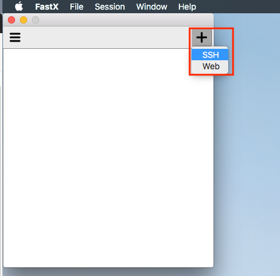
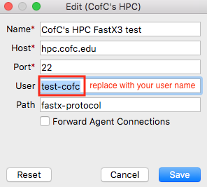
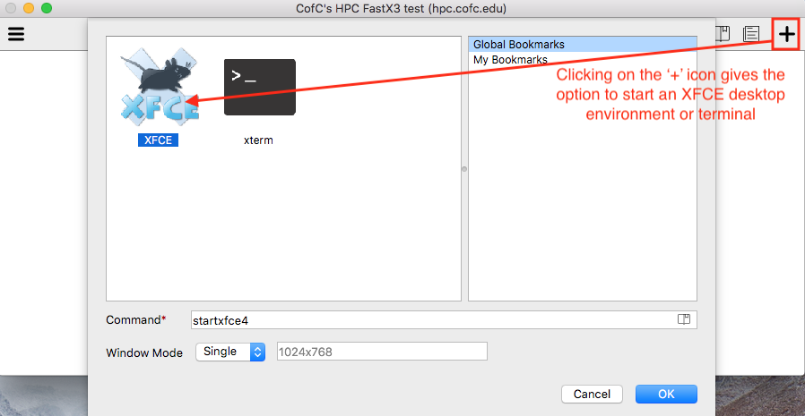
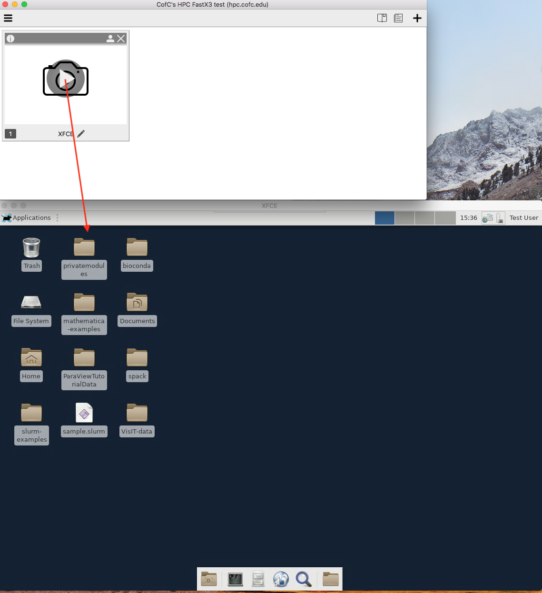
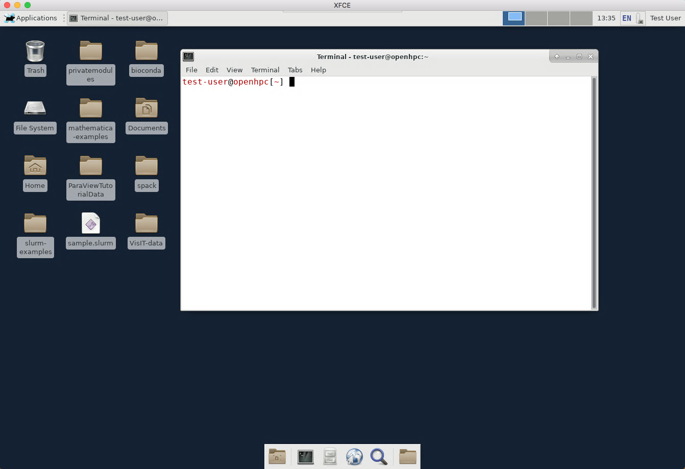
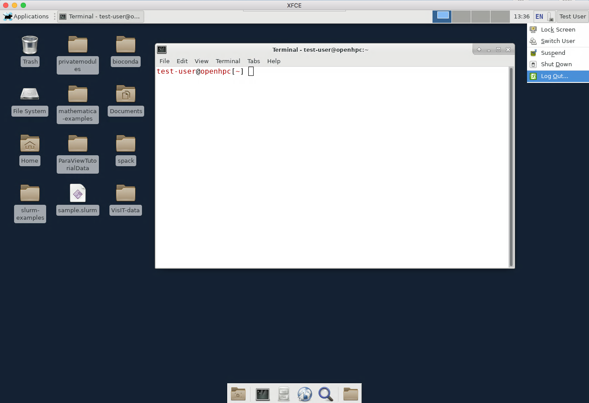
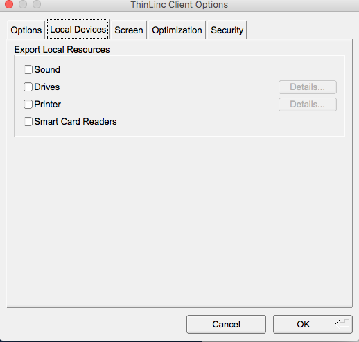
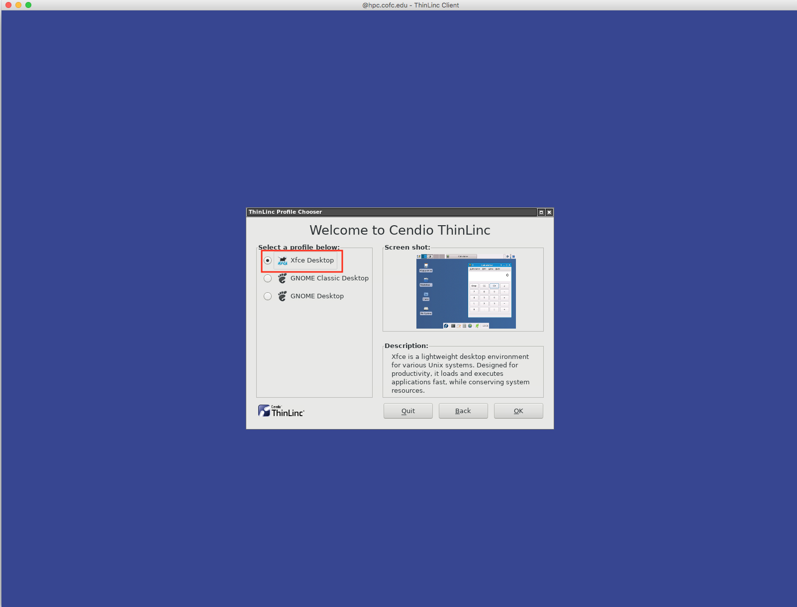
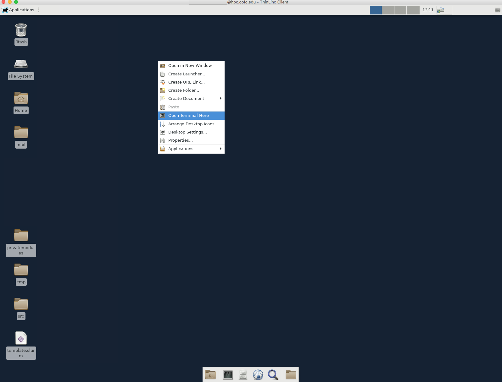

# GUI - remote desktop

## **SUMMARY**

Graphical user interfaces \(GUIs\) enable users to compute on the cluster using little or no command line tools. These graphical access options come in two forms:

* Remote desktop sessions
  * FastX desktop client
  * ThinLinc desktop client
* Web interface
  * FastX web client
  * Using web applications such as 
    * Jupyter Notebooks, 
    * WebMO and
    * other web gateways

The steps below outline how users can get remote desktop access to our HPC cluster

We have a [Cendio Thinlinc](https://www.cendio.com/thinlinc/download) remote desktop server running on the cluster to provide users access to a graphical Linux environment. _We only have 5 concurrent licenses, so please close the remote desktop session and exit as soon as you are finished._ Users would need to download and install a Thinlinc Client from the [Cendio](https://www.cendio.com/thinlinc/download) site. There are Thinlinc Clients for Windows, MacOS and Linux.

## RDP using StarNet FastX

A new remote desktop service \(StarNet's [FastX3](https://www.starnet.com/fastx)\) is available to provide a fully graphical Linux environment on the HPC. StarNet's [FastX3](https://www.starnet.com/fastx) is a tool for remote desktop access to Linux systems. We have a FastX server running on the cluster and users can connect to the cluster using a

* FastX desktop client or
* Web client 

A FastX3 interactive session can be disconnected from without closing the session, allowing users to leave applications running and resume their sessions from other locations. More information on this utility can be found on the StarNet website: [https://www.starnet.com/fastx](https://www.starnet.com/fastx)

### Desktop Client

Here are [steps](https://www.chpc.utah.edu/documentation/software/fastx2.php#utdc) as adapted from University of Utah's HPC center  

* Download the [latest FastX client for your OS](https://www.starnet.com/download/fastx3?ID=1034252-255).
* Start the FastX client on your desktop \(_Note: If you are connecting using a VPN, be sure to start the VPN prior to opening the FastX client.\)_
* Use the "**+**" found in the upper right corner to define a server.

* You need to provide a **name**, the **host** and a **user** \(your HPC user name\) data. ****
  * Servers can be edited \(clicking on the right "pencil"\) or deleted by clicking on the X-icon on the right edge.
  * You can create several entries \(i.e. different hosts & user names\)

* Once you have servers defined you can select one of them and login by clicking on them. 

* When you do so, two windows will open. In the top window, you will be asked to enter your password. As soon as you are logged, the password window will disappear and the main window will appear. To open a new session on this server, click on the "**+**" symbol in the top window.

* A new window will pop up. **You need to either take one of the options given in the window** **or add a command**. When you do this the session becomes defined in this window, along with the start and last connect time, and a new window opens for your session. Your choice depends on your needs.  There are both full desktop \(XFCE desktops\) and different xterm/terminal options**.**

* You can open a terminal or run any graphical applications from the graphical desktop session.

* If you want to finish the session, you can close this window.  Please do this for any session that you are done with to ensure there are sufficient resources available to meet the active user needs. If you want to keep the session in order to return to it, right click on the session name in the list and select the pause \("**\|\|**"  button\)  You can close the FastX window listing the sessions at this point, and this closes your connection on the server. To reconnect, either from the same desktop or another, start FastX, select and login to the same server, and you should see your saved session. Right click on the session, and select the "play" button. All windows you had open when you disconnected will appear.

* Please be sure to close any sessions you no longer need to keep the number of sessions at a minimum.

### Web Client

The steps to access the cluster using a web client are the same as those outlined for the desktop client 

* Open a web browser on your local computer and point it to `hpc.cofc.edu` port `3300`
* Fill out the proceeding pages with your user name, server name and login credentials

While the FastX web client is very convenient, it does pose security concerns. To prevent these security issues from being exploited, users should make sure

1. they are using it on a secure personal that only they have access to. Please DO NOT use the client on a public or shared computer.
2. do not save any login credentials after they are done with a session. 

_Much like other services, you would need to connected to the CofC VPN before accessing these remote desktop services._

## RDP using Cendio ThinLinc

_We only have 5 concurrent licenses of Cendio Thinlinc, so please close the remote desktop session and exit as soon as you are finished._  

### Desktop Client

We have a [Cendio Thinlinc ](https://www.cendio.com/)remote desktop server running on the cluster to provide users access to a graphical Linux environment. 

* Download and install a Thinlinc Client. There are Thinlinc Clients for Windows, MacOS and Linux. [https://www.cendio.com/thinlinc/download](https://www.cendio.com/thinlinc/download)
* After installing the Thinlinc Client, you can start the application and provide the necessary information to start the remote desktop session.

* To ensure optimal usage without consuming a lot of resources on the client as well as server side, we recommend that you make the following changes to the under '**Options**'.

* After you provide all the necessary information to log in, you will be asked to pick a 'Profile' or desktop manager. To prevent these remote desktop from taking too many resources in the login node, we suggest that you use a clean and lightweight desktop like XFCE.

* Once you have picked a 'profile' or desktop manager, you should see a Linux remote desktop environment.

**Note:** _Because we only have 5 concurrent licenses, please close the remote desktop session and exit as soon as you are finished._

## Web Interfaces

Some web interfaces enable setting up, running and analyzing HPC from a web browser. Two of those approaches will be discussed below.

### Jupyter Notebooks

Please see the page below



### WebMO

Please see the page below



