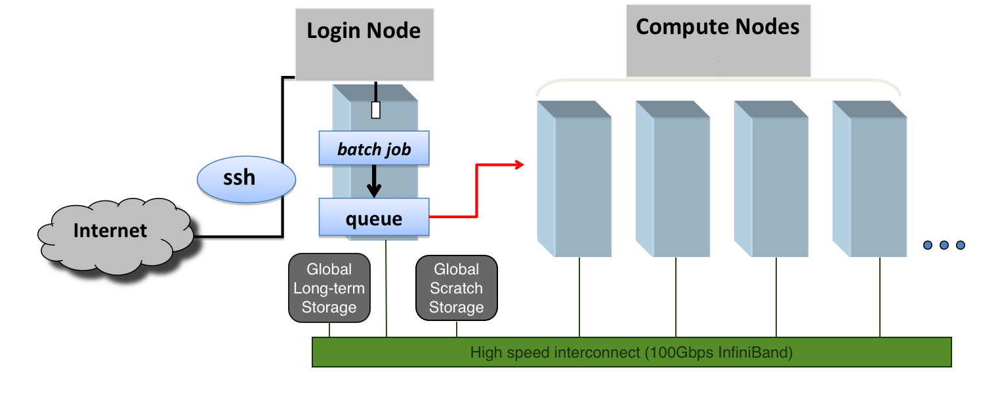
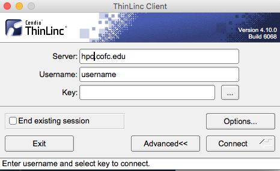
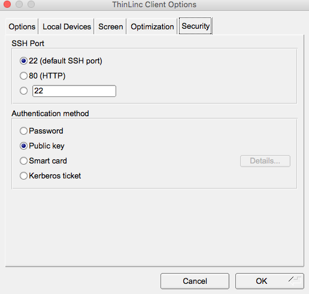
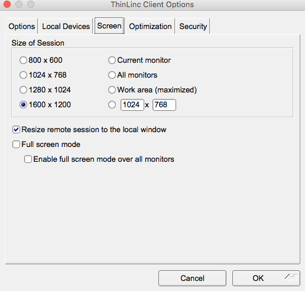

# Quickstart Guide

One of the biggest challenges for new HPC users is figuring out where to start. This page hopefully helps overcome that hurdle. If not, you can always email [hpc@cofc.edu](mailto:hpc.cofc.edu) to seek help.

## The HPC Cluster

The HPC cluster is a commodity Linux cluster containing many compute, storage and networking equipment all assembled into a standard rack. It is largely accessed remotely via SSH although some applications can be accessed using web interfaces and remote desktop tools.  



### Hardware Specs

The cluster is composed of the following main components:

* **A login/visualization node/node** - this is the server you connect to when you log into `hpc.cofc.edu`. The login node is intended for simple tasks like 
  * compiling and testing code, 
  * preparing and submitting jobs, 
  * checking on job status, 
  * doing non-intensive analysis and visualization
  * transferring data to/from the cluster
* **13 Compute nodes** - these are the workhorses of the cluster that perform all your heavy computations. You generally submit calculations to these compute nodes using the SLURM batch scheduler, or you can do interactive computations by reserving nodes using the same SLURM scheduler. You would rarely need  of the cluster. For computational work both Serial or Parallel, in Batch mode or Interactive mode, you will be using the compute nodes.
* **Other components you need not worry about**  - 
  * Storage 
    * long-term permanent storage nodes
    * short-term scratch storage nodes
  * Networking 
    * out-of-band management switch
    * high-speed InfiniBand interconnect

### General Process

Running calculations on the HPC takes different forms, but here are some typical steps

* **Request an account**. It may take as long as 24 hours to create your accounts and run test calculations similar to what you intend to run.
* Once you have an account, **log into the HPC cluster** via command line SSH or remote desktop client
* **Transfer data** from your local computer and/or other sources to the HPC cluster
* Find software to run from the cluster itself, download from a remote source, or compile your own code
* **Prepare input** files
* **Prepare batch submission files**
* **Submit your batch submission files** to the queue manager to start the calculation
* **Check on the calculations** as they progress 
* **Analyze the results** when they finish either on the HPC login node or copy the data to your local computer for analysis and visualization

## Request an Account

* Faculty and staff can request accounts emailing [hpc@cofc.edu](mailto:hpc@cofc.edu?subject=Requesting%20new%20faculty/staff%20account).
* Students are eligible for accounts upon endorsement or sponsorship by their faculty/staff mentor/advisor. Their faculty/staff mentor/advisor can send an email request to [hpc@cofc.edu](mailto:hpc@cofc.edu?subject=Requesting%20new%20student%20account) on their behalf to initiate the account creation process.

You can read more about [requesting account access](request-access.md).

During the account request process, you will be asked about how you intend to use the HPC so that we can make sure all the software and tools you need are available on the cluster. We also run a few tests and assist new users get started on the cluster based on the information you provide in the account request form.

## Log into the HPC Cluster

Most users will access the cluster with a **command line interface \(CLI\) using an SSH client**. However, some may choose a **graphical user interface \(GUI\)** or a **web interface** to use the cluster.

### Command line interface \(CLI\)

You would need an SSH client on your local computer to connect to the HPC cluster. MacOS and Linux provide SSH clients while most Windows machines require users to install external SSH clients. 

In all cases, you would need to provide the following:

* hostname - hpc.cofc.edu
* user name - your user name
* your password or SSH public key location
* protocol and ports -  if not populated by default, you can pick 'SSH' protocol running on port '22'



Windows 10 now has a Bash shell. If you are using an older version of Windows, you have the following options, among others for sure.

* [MobaTerm](https://mobaxterm.mobatek.net) - It provides SSH, X11, VNC and FTP clients .
* [XManager](https://www.netsarang.com/en/xmanager)
* [Git Bash](https://git-scm.com/download/win) – Part of the Git for Windows environment includes Git Bash, which provides a light weight ssh client.
* [PuTTY](http://www.chiark.greenend.org.uk/~sgtatham/putty/) - SSH client and Bash environment for Windows.



Both Mac OS and Linux distributions include a BASH terminal and an SSH client by default. No additional software should be required to access the HPC cluster.

Mac OS users can go to **Applications &gt; Utilities &gt; Terminal.app** to open the Mac Terminal. Different Linux distributions offer terminals and feature them prominently.



To log into the cluster, open a terminal and enter the following command:

* `ssh username@hpc.cofc.edu`

If you want the ability to see graphical outputs from the cluster, give `ssh` a '-X' or '-Y' flag.

* `ssh -X username@hpc.cofc.edu`

You will be prompted to enter your password to log in. In the long run, you probably want to generate an SSH key that would allow you to log in without entering a password every time.

### Graphical user interface \(GUI\)

GUIs enable users to compute on the cluster using little or no command line tools. These graphical access options come in two forms:

* Remote desktop sessions
* Web interface

#### Remote desktop sessions

We have a [ThinLinc Cendio ](https://www.cendio.com/)remote desktop server running on the cluster to provide users access to a graphical Linux environment. _We only have 5 concurrent licenses, so please close the remote desktop session and exit as soon as you are finished._ Users would need to download and install a Thinlinc Client from the [Cendio site](https://www.cendio.com/thinlinc/download). There are Thinlinc Clients for Windows, MacOS and Linux.

After installing the Thinlinc Client, you can start the application and provide the necessary information to start the remote desktop session.



To ensure optimal usage without consuming a lot of resources on the client as well as server side, we recommend that you make the following  changes to the under '**Options**'.






After you provide all the necessary information to log in, you will be asked to pick a 'Profile' or desktop manager. To prevent these remote desktop from taking too many resources in the login node, we suggest that you use a clean and lightweight desktop like XFCE.


Once you have picked a 'profile' or desktop manager, you should see a Linux remote desktop environment. 


**Note:**  _Because we only have 5 concurrent licenses, please close the remote desktop session and exit as soon as you are finished._ 

#### Web Interface

To make using the HPC cluster easier, some applications can be accessed using a web interface. Two such applications at the moment are WebMO and Jupyter Notebook.

* [WebMO](scheduling-jobs/webmo.md) is a web interface to many computational chemistry programs. It has many powerful capabilities that give users access to computational chemistry tools without having to use a command line.
* [Jupyter Notebook](scheduling-jobs/jupyter-notebooks.md) allows users to access and run Anaconda versions of Python 2/3, R and other applications using a web interface.

## Transfer Data to the HPC Cluster

From your local computer, you can transfer your data to the cluster using `scp`, `rsync` or [any command line or graphical tool](transfer-data.md)

### Using scp

To copy a single file

* `scp ./local_file myusername@hpc.cofc.edu:/home/myusername`  

To copy a directory recursively

* `scp -r ./local_file myusername@hpc.cofc.edu:/home/myusername`

### Using rsync

To copy a single file

* `scp ./local_file myusername@hpc.cofc.edu:/home/myusername`  

  To copy a directory recursively

* `scp -r ./local_file myusername@hpc.cofc.edu:/home/myusername`

## Access Software

Our cluster uses LMod modules to provision software to users. LMod [modules](modules/) set paths to executables, libraries, include files and help pages for the requested software. They also load up any software the requested software depends on. 

Users are welcome to install any software on their home directories and access them using custom module files or by setting up their environment in more traditional ways.

### Modules

The default software stack is built using GNU8 compilers and OpenMPI3 message passing libraries. Other software that does not depend on GNU8 and OpenMPI3 libraries will also be available. As you change the compiler from GNU8, to GNU7, GNU5 or Intel2019, and the message library from OpenMPI3 to OpenMPI1, MPICH, MVAPICH or impi, the available software will vary. However, we try our best to make most software available within each stack.

Here are some helpful commands to use Lmod Modules. 

* See a list of currently loaded modules
  * ```sql
    user@hpc[~] module list

    Currently Loaded Modules:
      1) autotools   2) prun/1.2   3) gnu8/8.3.0   4) openmpi3/3.1.3   5) ohpc
    ```
* See all available modules
  * ```sql
    user@hpc[~] module avail

    ---------------------------------------------------------- /opt/ohpc/pub/moduledeps/gnu8-openmpi3 ----------------------------------------------------------
       adios/1.13.1     hypre/2.15.1    netcdf-cxx/4.3.0        phdf5/1.10.4        py3-mpi4py/3.0.0    sionlib/1.7.2
  
    -------------------------------------------------------------- /opt/ohpc/pub/moduledeps/gnu8 ---------------------------------------------------------------
       R/3.5.2       gsl/2.5            likwid/4.3.3    mvapich2/2.3      openmpi3/3.1.3 (L)    py2-numpy/1.15.3
 
    ---------------------------------------------------------------- /opt/ohpc/pub/modulefiles -----------------------------------------------------------------
       EasyBuild/3.7.1             chem/gamess/2018-R2      cmake/3.12.2            math/mathematica/12.0        prun/1.2            (L)
 
    ```
* See a description of all available software
  * ```sql
    user@hpc[~] module spider

    --------------------------------------------------------------------------------------------------------------------------------------------------------
    The following is a list of the modules currently available:
    --------------------------------------------------------------------------------------------------------------------------------------------------------
      EasyBuild: EasyBuild/3.7.1
        Build and installation framework

      R: R/3.4.2, R/3.5.0, R/3.5.2
        R is a language and environment for statistical computing and graphics (S-Plus like).

    ...
    ```
* Unload a module
  * ```sql
    user@hpc[~] module unload gnu8

    Inactive Modules:
      1) openmpi3
    ```
* Swap a module with a different version
  * ```sql
    user@hpc[~] module swap gnu8 gnu7

    The following have been reloaded with a version change:
      1) openmpi3/3.1.3 => openmpi3/3.1.0

    ```

## Submit a job/calculation

Our cluster uses SLURM queue manager to schedule calculations \(or jobs, as they are commonly called\). Generally, users log into the login node, prepare their calculations and submit them to a SLURM queue manager, which sends the calculations to run on our many compute nodes that have the necessary resources for that particular calculation.

### SLURM

A SLURM batch submission file typically looks like this:

```bash
#!/bin/bash

#SBATCH -p stdmemq          # Submit to 'stdmemq' Partitiion or queue
#SBATCH -J MPItest          # Name the job as 'MPItest'
#SBATCH -o MPItest-%j.out   # Write the standard output to file named 'jMPItest-<job_number>.out'
#SBATCH -e MPItest-%j.err   # Write the standard error to file named 'jMPItest-<job_number>.err'
#SBATCH -t 0-12:00:00        # Run for a maximum time of 0 days, 12 hours, 00 mins, 00 secs
#SBATCH --nodes=1            # Request N nodes
#SBATCH --ntasks-per-node=20 # Request n cores or task per node
#SBATCH --mem-per-cpu=4GB   # Request 4GB RAM per core
#SBATCH --mail-type=ALL      # Send email notification at the start and end of the job
#SBATCH --mail-user=<user>@cofc.edu  # Send email notification to this address (update <user>)

module list                 # will list modules loaded by default. In our case, it will be GNU8 compilers and OpenMPI3 MPI libraries
module swap openmpi3 mpich  # swap the MPI library from the default 'openmpi3' to 'mpich'.
module list                 # will list modules loaded; we'll just use this to check that the modules we selected are indeed loaded
pwd                         # prints current working directory
date                        # prints the date and time

mpirun hello_world_c        # run the MPI job
```

One can submit this SLURM batch submission file to the queue manager using the `sbatch` command. Here are some usage information for common SLURM commands.

* Submit a job
  * ```sql
    user@host[~]:   sbatch your_script.slurm
    Submitted batch job 4359
    ```
* Get list of running jobs 
  * ```sql
    user@host[~]:   squeue
     JOBID  PARTITION  NAME      USER   STATE    TIME        TIME_LIMI   CPUS  NODES  NODELIST(REASON)
    4340   gpuq       testjob1  user1  RUNNING  2-03:06:55  4-00:00:00  2     1      gpu1
    4349   stdmemq    testjob2  user2  RUNNING  1:36:09     2-00:00:00  2     1      compute1
    4347   bigmemq    testjob3  user2  RUNNING  18:34:07    2-00:00:00  40    1      bigmem1
    ```
* Delete a job 
  * ```sql
    user@host[~]:   scancel JOB_ID
    ```
* Get an overview of the cluster's resources and queues
  * ```sql
    user@host[~]:   sinfo -o "%20P %5a %.10l %16F"
    PARTITION            AVAIL  TIMELIMIT NODES(A/I/O/T)
    stdmemq*             up    2-00:00:00 10/1/0/11
    stdmemq-long         up    4-00:00:00 1/2/0/3
    bigmemq              up    2-00:00:00 1/0/0/1
    gpuq                 up    4-00:00:00 1/1/0/2
    debugq               up       2:00:00 1/3/0/4
    scavengeq            up    1-00:00:00 2/11/0/13
    ```


