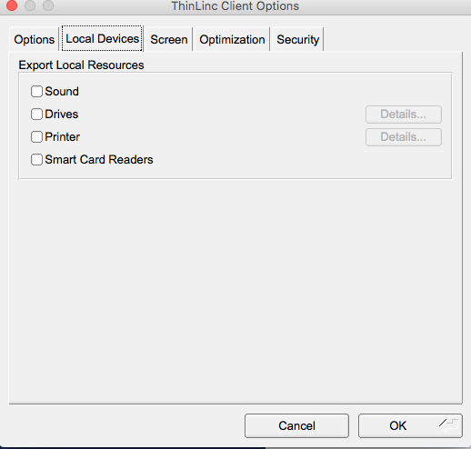

# Quickstart Guide

One of the biggest challenges for new HPC users is figuring out where to start. This page hopefully helps overcome that hurdle. If not, you can always email [hpc@cofc.edu](mailto:hpc.cofc.edu) to seek help.

## Request an Account

* Faculty and staff can request accounts emailing [hpc@cofc.edu](mailto:hpc@cofc.edu?subject=Requesting%20new%20faculty/staff%20account).
* Students are eligible for accounts upon endorsement or sponsorship by their faculty/staff mentor/advisor. Their faculty/staff mentor/advisor can send an email request to [hpc@cofc.edu](mailto:hpc@cofc.edu?subject=Requesting%20new%20student%20account) on their behalf to initiate the account creation process.

You can read more about [requesting account access](request-access.md).

During the account request process, you will be asked about how you intend to use the HPC so that we can make sure all the software and tools you need are available on the cluster. We also run a few tests and assist new users get started on the cluster based on the information you provide in the account request form.

## Access the HPC Cluster

Most users will access the cluster with a **command line interface \(CLI\) using an SSH client**. However, some may choose a **graphical user interface \(GUI\)** or a **web interface** to use the cluster.

### Command line interface \(CLI\)

You would need an SSH client on your local computer to connect to the HPC cluster. MacOS and Linux provide SSH clients while most Windows machines require users to install external SSH clients. 

In all cases, you would need to provide the following:

* hostname - hpc.cofc.edu
* user name - your user name
* your password or SSH public key location
* protocol and ports -  if not populated by default, you can pick 'SSH' protocol running on port '22'



Windows 10 now has a Bash shell. If you are using an older version of Windows, you have the following options, among others for sure.

* [MobaTerm](https://mobaxterm.mobatek.net) - It provides SSH, X11, VNC and FTP clients .
* [XManager](https://www.netsarang.com/en/xmanager)
* [Git Bash](https://git-scm.com/download/win) – Part of the Git for Windows environment includes Git Bash, which provides a light weight ssh client.
* [PuTTY](http://www.chiark.greenend.org.uk/~sgtatham/putty/) - SSH client and Bash environment for Windows.



Both Mac OS and Linux distributions include a BASH terminal and an SSH client by default. No additional software should be required to access the HPC cluster.

Mac OS users can go to **Applications > Utilities > Terminal.app** to open the Mac Terminal. Different Linux distributions offer terminals and feature them prominently.



To log into the cluster, open a terminal and enter the following command:

* `ssh username@hpc.cofc.edu`

If you want the ability to see graphical outputs from the cluster, give `ssh` a '-X' or '-Y' flag.

* `ssh -X username@hpc.cofc.edu`

You will be prompted to enter your password to log in. In the long run, you probably want to generate an SSH key that would allow you to log in without entering a password every time.

### Graphical user interface \(GUI\)

GUIs enable users to compute on the cluster using little or no command line tools. These graphical access options come in two forms:

* Remote desktop sessions
* Web interface

#### Remote desktop sessions

We have a [ThinLinc Cendio ](https://www.cendio.com/)remote desktop server running on the cluster to provide users access to a graphical Linux environment. _We only have 5 concurrent licenses, so please close the remote desktop session and exit as soon as you are finished._ Users would need to download and install a Thinlinc Client from the [Cendio site](https://www.cendio.com/thinlinc/download). There are Thinlinc Clients for Windows, MacOS and Linux.

After installing the Thinlinc Client, you can start the application and provide the necessary information to start the remote desktop session.

To ensure optimal usage without consuming a lot of resources on the client as well as server side, we recommend that you make the following  changes to the under '**Options**'.

After you provide all the necessary information to log in, you will be asked to pick a 'Profile' or desktop manager. To prevent these remote desktop from taking too many resources in the login node, we suggest that you use a clean and lightweight desktop like XFCE.

Once you have picked a 'profile' or desktop manager, you should see a Linux remote desktop environment. 

**Note:**  _Because we only have 5 concurrent licenses, please close the remote desktop session and exit as soon as you are finished._ 

#### Web Interface

To make using the HPC cluster easier, some applications can be accessed using a web interface. Two such applications at the moment are WebMO and Jupyter Notebook.

* [WebMO](modules/webmo.md) is a web interface to many computational chemistry programs. It has many powerful capabilities that give users access to computational chemistry tools without having to use a command line.
* [Jupyter Notebook](modules/jupyter-notebooks.md) allows users to access and run Anaconda versions of Python 2/3, R and other applications using a web interface.

## Transfer Data to the HPC Cluster

From your local computer, you can transfer your data to the cluster using `scp`, `rsync` or [any command line or graphical tool](transfer-data.md)

### Using scp

To copy a single file

* `scp ./local_file myusername@hpc.cofc.edu:/home/myusername`  

To copy a directory recursively

* `scp -r ./local_file myusername@hpc.cofc.edu:/home/myusername`

### Using rsync

To copy a single file

* `scp ./local_file myusername@hpc.cofc.edu:/home/myusername`  

  To copy a directory recursively

* `scp -r ./local_file myusername@hpc.cofc.edu:/home/myusername`

