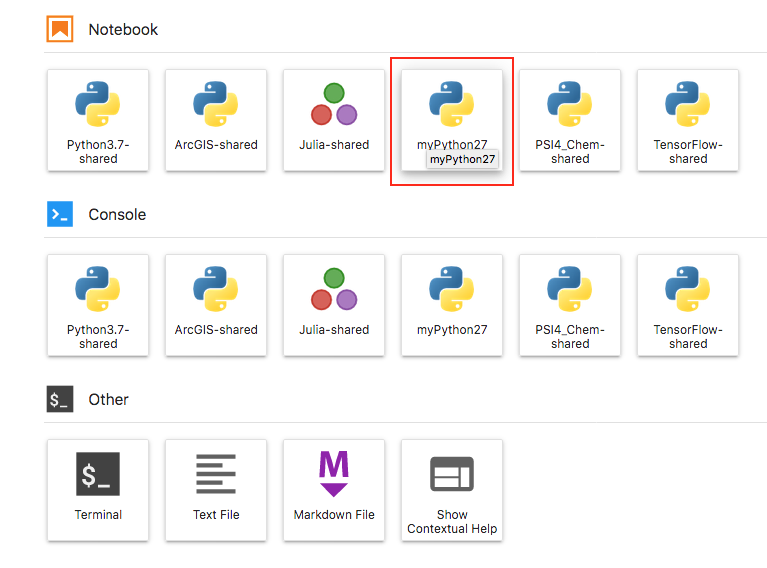
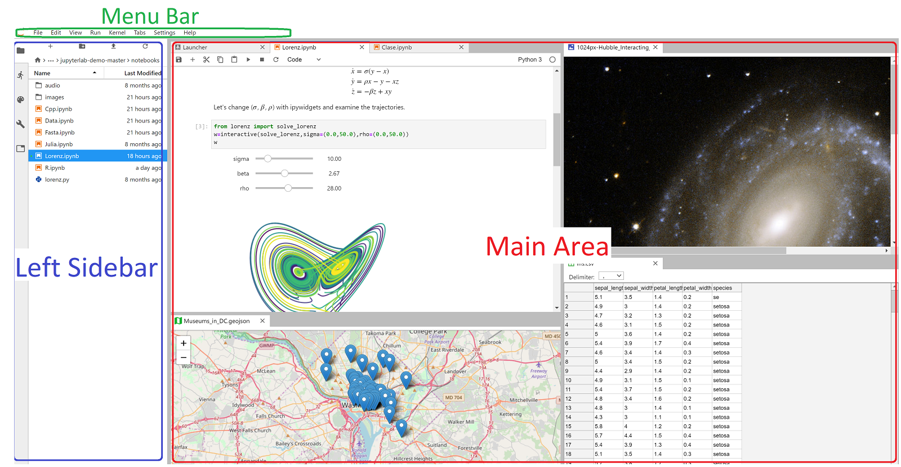
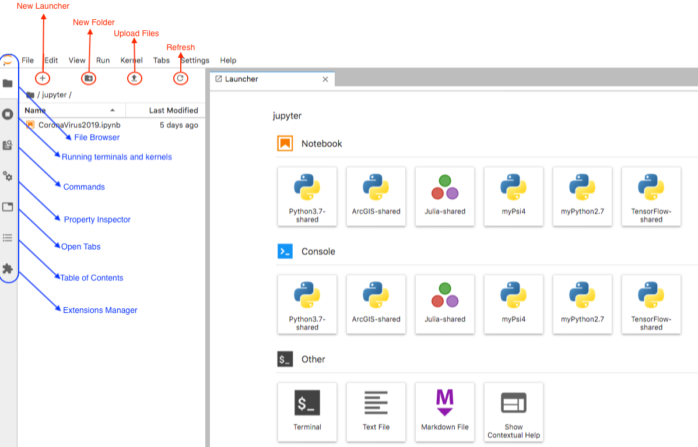
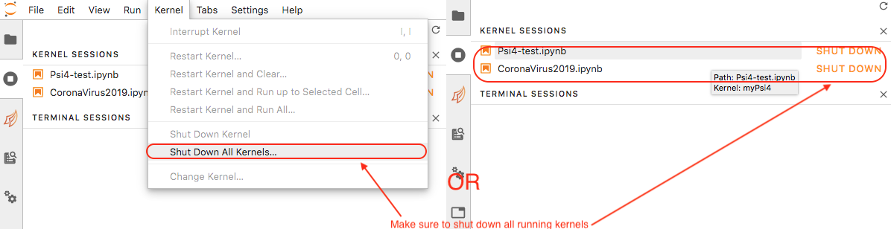
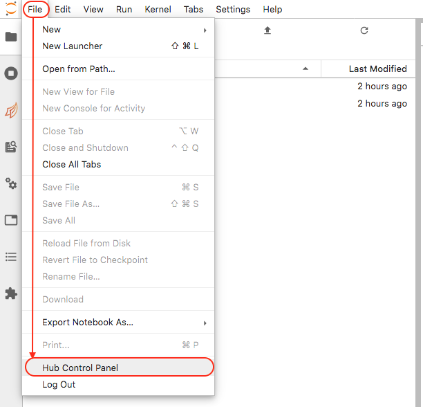
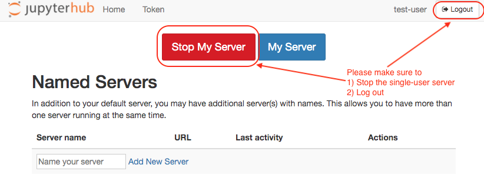

# JupyterHub

## Project Jupyter Overview

[Project Jupyter](https://jupyter.org/) provides tools for users to do interactive computing using different programming languages on a unified web interface. It has many components intended for single-user or multi-user environments running on personal computers or shared resources like our HPC cluster. Depending on one's needs, it is possible to deploy one or more of these components together.

### Single-user Jupyter Notebooks

[Jupyter Notebooks](https://jupyter-notebook.readthedocs.io/) are single-user web-based interactive notebooks. They allow users to create and share documents that contain live code, equations, visualizations and narrative text. Using Anaconda, anyone can install and run Jupyter Notebooks on their local computer. However, to be able to run Jupyter Notebooks on a remote shared resource like our HPC, one would need to log into the HPC cluster, use the commandline to reserve computing resources and set up some cumbersome SSH tunneling as described [here](jupyter-notebooks.md). A more convenient way to run Jupyter Notebooks on a shared resource is using JupyterHub.

### Multi-user environments using JupyterHub

[JupyterHub](https://github.com/jupyterhub/jupyterhub) is the great way to serve single-user Jupyter Notebooks to a large number of users in a clean and secure way. It allows multiple authentication methods and integrates with our HPC's batch scheduler to request computing resources and spawn Jupyter Notebook servers \(`jupyterhub-singleuser` \) on those computing resources when they become available. 

### JupyterHub+JupyterLab for a complete interactive web interface

[JupyterLab](https://jupyterlab.readthedocs.io/) adds powerful plugins like the terminals, file browsers, built-in Markdown editor, ability to start and stop multiple kernels, and many other extensions to any JupyterHub installation. All these capabilities enable users to do all their interactive computation from the JupyterLab+JupyterHub interface.

See the video below to review some of these capabilities:




## Typical Workflow

A typical workflow for  a user on our JupyterHub installation would look like this: 

1. Use a browser to connect to our JupyterHub installation \([https://hpc.cofc.edu/jupyterhub](https://hpc.cofc.edu/jupyterhub)\)
2. Log in with your CofC HPC credentials
3. Request a resource
   * Local login node for tasks that are not computationally intensive
     * your notebook server will be shut down after a period of inactivity
   * Compute node for computationally intensive tasks
     * your notebook server will be shut down when your allocated time runs out or when you explicitly stop your notebook server
4. Open your notebook using the appropriate kernel
   * Shared kernels - these kernels have most of the libraries you would need, but you can't install new packages into the kernels if anything is missing
   * User kernels - these are kernels you install in your user space \( `$HOME/.conda/env`\) and have full control over
5. Run your notebook or perform any other tasks
6. Shut down all kernels and the notebook server when you finish

## Accessing our JupyterHub Installation

 Our JupyterHub installation can be found at [https://hpc.cofc.edu/jupyterhub](https://hpc.cofc.edu/jupyterhub). To access it, 

* users need to have a CofC HPC account
* users need to  
  * be on our campus 'wired' or 'eduroam' wireless networks or 
  * use our CofC VPN if they are off-campus


 Please note that users will need to be added to the CofC HPC VPN group to access the HPC and services it hosts like JupyterHub.


## Requesting Resources

Once you log into our JupyterHub installation, you will see a **Server Options** page asking for the resources you need. Please note that there may be 5-10 second delay as the server confirms your credentials and starts up your environment. From the **Select a job profile** dropdown menu, please select the appropriate resource based on your needs. 


* **Login-local \(access to login node; no heavy computations allowed\)**
  * If you simply want to look at data, transfer files or some non-intensive analysis, this is the best option for you. It allows you to perform these simple tasks on the login node.You should, however, not run anything computationally intensive because you are on a shared server with many other users. If you intend to run demanding computations, please request one of the other job profiles.


* Do not run anything computationally intensive on the login node.
* By the same token, if you are not doing anything computationally intensive, do not waste resources by requesting compute modes.
* In short, request the right resource for your needs every time. 


* **Compute-8 cores, 32GB for 2 hrs** - 
  * this requests 8 computing cores, 32GB memory for 2 hours in one of the compute nodes. 
    * If the resources you requested are available immediately, it will spawn a single-user Jupyter Notebook for you in the compute node
    * If the resources you requested are not available immediately, the server will wait for as long as 120 seconds to see if anything becomes available. If it does not find the resources you requested, it will inform you to try making the request later.
* **Compute-8 cores, 32GB for 4 hrs** -
* **Compute-16 cores, 64GB for 2 hrs** -
* **Compute-16 cores, 64GB for 4 hrs** -
* ...
* **Compute-1 GPU, 24 cores, 180GB for 2 hrs** -
  * This one further requests one of our Nvidia Tesla V100 GPUs. We'll add the capability to request our NVIDIA Quadro P4000 GPU is there is interest. 
* **Compute-1 GPU, 24 cores, 180GB for 4 hrs** -


If the time \(time limit\) or resources \(\#CPUs, memory, GPUs\) from the above profiles are not enough for your computing needs,  please email `hpc@cofc.edu` for help and we'll accommodate  your request. 


Once the requested resource is available, you will have a single-user Jupyter notebook server running on that resource.

## Kernels

What makes Project Jupyter powerful is that it allows users to run notebooks written in many programming languages even though Python\(iPython\) is the original language of choice. We provide a set system-wide kernels all users can access, but not modify. Users can add their own kernels and make it visible to the Jupyter environment.

If you open a terminal on the designated resource, load the `anaconda/3` module, activate the  `jupyter-hub` environment, and enter `jupyter kernelspec list`, you will see the system-wide and user kernels available to you.

```bash
$user@hpc[~] module load anaconda/3
Currently Loaded Modules:
  1) autotools   2) prun/1.2   3) gnu8/8.3.0   4) openmpi3/3.1.3   
  5) ohpc   6) use.own   7) anaconda/3/2020.02
  
$user@hpc[~] source activate jupyter-hub

$user@hpc[~] conda env list
# conda environments:
#
base                     /opt/ohpc/pub/apps/anaconda/3/2020.02
arcgis                   /opt/ohpc/pub/apps/anaconda/3/2020.02/envs/arcgis
jupyter-hub  >> * <<    /opt/ohpc/pub/apps/anaconda/3/2020.02/envs/jupyter-hub
psi4                     /opt/ohpc/pub/apps/anaconda/3/2020.02/envs/psi4
tensorflow               /opt/ohpc/pub/apps/anaconda/3/2020.02/envs/tensorflow
  
$user@hpc[~]  jupyter kernelspec list
Available kernels:
 >>system-wide kernels stored at /opt/ohpc/pub<< 
  arcgis         /opt/ohpc/pub/apps/anaconda/3/2020.02/envs/jupyter-hub/share/jupyter/kernels/arcgis
  julia-1.4      /opt/ohpc/pub/apps/anaconda/3/2020.02/envs/jupyter-hub/share/jupyter/kernels/julia-1.4
  python3        /opt/ohpc/pub/apps/anaconda/3/2020.02/envs/jupyter-hub/share/jupyter/kernels/python3
  tensorflow     /opt/ohpc/pub/apps/anaconda/3/2020.02/envs/jupyter-hub/share/jupyter/kernels/tensorflow

  >>user kernels stored at /home/user/.conda/<< 
  jupyter_2.7    /home/user/.local/share/jupyter/kernels/jupyter_2.7
  psi4           /home/user/.local/share/jupyter/kernels/psi4
```

### System-wide/Shared kernels

We currently provide systemwide kernels  to run

* `Python3.7` - including most commonly used libraries such as `numpy`,  `scipy`, `matplotlib`, `plotly`, `pandas`, `tensorflow`, `seaborn`, `imblearn, numba, dask`.
* `Tensorflow2.0` - including the most commonly used libraries listed above and with support for GPUs 
* `iR` - kernel to run R/3.5.2
* `iJulia` - to run Julia code  
* `Psi4`- to run Psi4 notebooks for computational chemistry
* `Matlab` - to run matlab/r2019b - **not added yet**
* `Mathematica`  - to run mathematica/12 - **not added yet**
* \*\*\*\*

These system-wide kernels are installed at `/opt/ohpc/pub/apps/anaconda/3/2020.02/envs` where users do not have permission to modify them. Therefore, in cases where these kernels are insufficient, users would need to

* email `hpc@cofc.edu` to ask for modifications of these kernels or installation of additional ones OR
* install an environment in their own user space and make it available to the Jupyter server


The names of the system-wide kernels has a "-shared' suffix to distinguish them from kernels in your user space. Users are encouraged to give unique names to their own kernels as well.


### User kernels

To install a new user kernel, say to install `Python 2.7` , you would need to

* open a terminal in the HPC cluster
* load the appropriate anaconda or miniconda module and activate the base environment if it isn't already
* create a new environment
* install the packages \(**including ipykernel**\) you want inside that environment
* make that kernel visible to Jupyter

These steps are explained below.

#### Log into the HPC 

You can [access the HPC](../access-hpc/) different ways, but the easiest way would be using the JupyterHub. Log into our JupyterHub installation and open a terminal from the ensuing dashboard.

#### Load anaconda module

You are encouraged to use the latest anaconda installation \(which is the default\), but slightly older versions should work as well.

```bash
$user@hpc[~] module list
Currently Loaded Modules:
  1) autotools   2) prun/1.2   3) gnu8/8.3.0   4) openmpi3/3.1.3   
  5) ohpc   6) use.own
  
$user@hpc[~] module load anaconda/3
Currently Loaded Modules:
  1) autotools   2) prun/1.2   3) gnu8/8.3.0   4) openmpi3/3.1.3   
  5) ohpc   6) use.own   7) anaconda/3/2020.02

$user@hpc[~] which conda
/opt/ohpc/pub/apps/anaconda/3/2020.02/bin/conda
```

#### Create a new environment

You would need to create a new environment for the new kernel in your user space. As you can see below, the default environment is the `base` containing base Python 3.7 and other useful tools like the `pip` and `conda` package managers. 

```bash
$user@hpc[~] conda env list
# conda environments:
#
myPython37               /home/user/.conda/envs/myPython37
base                  *  /opt/ohpc/pub/apps/anaconda/3/2020.02
arcgis                   /opt/ohpc/pub/apps/anaconda/3/2020.02/envs/arcgis
jupyter-hub              /opt/ohpc/pub/apps/anaconda/3/2020.02/envs/jupyter-hub
psi4                     /opt/ohpc/pub/apps/anaconda/3/2020.02/envs/psi4
tensorflow               /opt/ohpc/pub/apps/anaconda/3/2020.02/envs/tensorflow 

```


It is wise to append something \(e.g. `myPython37` instead of `Python37`\) to distinguish system-wide kernels from those in your user space.  If a kernel in your user space has the same name as a system-wide one, the system-wide one will have precedence.


Now, we'll create a Python 2.7 environment 

```bash
$user@hpc[~] conda create -n "myPython27" python=2.7
collecting package metadata (current_repodata.json): done
Solving environment: done

## Package Plan ##

  environment location: /home/test-user/.conda/envs/myPython27

  added / updated specs:
    - pip
    - python=2.7


The following packages will be downloaded:

    package                    |            build
    ---------------------------|-----------------
    certifi-2019.11.28         |           py27_0         153 KB
    libffi-3.3                 |       he6710b0_1          50 KB
    ncurses-6.2                |       he6710b0_1         817 KB
    pip-20.1                   |     pyh9f0ad1d_0         1.1 MB  conda-forge
    python-2.7.18              |       h15b4118_1         9.9 MB
    readline-8.0               |       h7b6447c_0         356 KB
    setuptools-41.0.1          |           py27_0         646 KB  intel
    sqlite-3.31.1              |       h62c20be_1         2.0 MB
    ------------------------------------------------------------
                                           Total:        14.9 MB

The following NEW packages will be INSTALLED:

  _libgcc_mutex      pkgs/main/linux-64::_libgcc_mutex-0.1-main
  ca-certificates    pkgs/main/linux-64::ca-certificates-2020.1.1-0
  certifi            pkgs/main/linux-64::certifi-2019.11.28-py27_0
  libedit            pkgs/main/linux-64::libedit-3.1.20181209-hc058e9b_0
  libffi             pkgs/main/linux-64::libffi-3.3-he6710b0_1
  libgcc-ng          pkgs/main/linux-64::libgcc-ng-9.1.0-hdf63c60_0
  libstdcxx-ng       pkgs/main/linux-64::libstdcxx-ng-9.1.0-hdf63c60_0
  ncurses            pkgs/main/linux-64::ncurses-6.2-he6710b0_1
  pip                conda-forge/noarch::pip-20.1-pyh9f0ad1d_0
  python             pkgs/main/linux-64::python-2.7.18-h15b4118_1
  readline           pkgs/main/linux-64::readline-8.0-h7b6447c_0
  setuptools         intel/linux-64::setuptools-41.0.1-py27_0
  sqlite             pkgs/main/linux-64::sqlite-3.31.1-h62c20be_1
  tk                 pkgs/main/linux-64::tk-8.6.8-hbc83047_0
  wheel              conda-forge/noarch::wheel-0.34.2-py_1
  zlib               pkgs/main/linux-64::zlib-1.2.11-h7b6447c_3


Proceed ([y]/n)? y 

Downloading and Extracting Packages
ncurses-6.2          | 817 KB    | ############################################################################################################################################################################################################ | 100% 
readline-8.0         | 356 KB    | ############################################################################################################################################################################################################ | 100% 
sqlite-3.31.1        | 2.0 MB    | ############################################################################################################################################################################################################ | 100% 
certifi-2019.11.28   | 153 KB    | ############################################################################################################################################################################################################ | 100% 
python-2.7.18        | 9.9 MB    | ############################################################################################################################################################################################################ | 100% 
setuptools-41.0.1    | 646 KB    | ############################################################################################################################################################################################################ | 100% 
libffi-3.3           | 50 KB     | ############################################################################################################################################################################################################ | 100% 
pip-20.1             | 1.1 MB    | ############################################################################################################################################################################################################ | 100% 
Preparing transaction: done
Verifying transaction: done
Executing transaction: done
#
# To activate this environment, use
#
#     $ conda activate myPython27
#
# To deactivate an active environment, use
#
#     $ conda deactivate

$user@hpc[~] conda env list
# conda environments:
#
>>myPython27               /home/user/.conda/envs/myPython27 <<
myPython37               /home/user/.conda/envs/myPython37
base                  *  /opt/ohpc/pub/apps/anaconda/3/2020.02
arcgis                   /opt/ohpc/pub/apps/anaconda/3/2020.02/envs/arcgis
jupyter-hub              /opt/ohpc/pub/apps/anaconda/3/2020.02/envs/jupyter-hub
psi4                     /opt/ohpc/pub/apps/anaconda/3/2020.02/envs/psi4
tensorflow               /opt/ohpc/pub/apps/anaconda/3/2020.02/envs/tensorflow

$user@hpc[~] source activate myPython27

$user@hpc[~] conda env list
# conda environments:
#
myPython27       >> * << /home/user/.conda/envs/myPython27
myPython37               /home/user/.conda/envs/myPython37
base                     /opt/ohpc/pub/apps/anaconda/3/2020.02
arcgis                   /opt/ohpc/pub/apps/anaconda/3/2020.02/envs/arcgis
jupyter-hub              /opt/ohpc/pub/apps/anaconda/3/2020.02/envs/jupyter-hub
psi4                     /opt/ohpc/pub/apps/anaconda/3/2020.02/envs/psi4
tensorflow               /opt/ohpc/pub/apps/anaconda/3/2020.02/envs/tensorflow
```

And install the most commonly used packages for scientific and data analysis

```bash
$(myPython27)user@hpc[~] conda install numpy python=2.7
$(myPython27)user@hpc[~] conda install matplotlib python=2.7
$(myPython27)user@hpc[~] conda install pandas python=2.7
.
.
.
$(myPython27)user@hpc[~] conda install ipykernel python=2.7
...
```


Do not forget to install iPykernel as you would need it to run your kernel in Jupyter Notebooks


#### Make that kernel visible to Jupyter

To be able to run your kernel in Jupyter Notebooks, you need to make it visible to our JupyterHub installation from the new environment.

```bash
$(myPython27)user@hpc[~] python -m ipykernel install --user --name "myPython27" --display-name "myPython27"
Installed kernelspec myPython27 in /home/user/.local/share/jupyter/kernels/mypython27
```

####  Verify that the kernel is installed and visible

You should deactivate the current environment, activate the `jupyter-hub`  environment, and check to see if the kernel is installed and visible

```bash
$(myPython27)user@hpc[~] conda deactivate

$(base)user@hpc[~]  conda env list
# conda environments:
#
myPython27               /home/user/.conda/envs/myPython27
myPython37               /home/user/.conda/envs/myPython37
base            >>  * << /opt/ohpc/pub/apps/anaconda/3/2020.02
arcgis                   /opt/ohpc/pub/apps/anaconda/3/2020.02/envs/arcgis
jupyter-hub              /opt/ohpc/pub/apps/anaconda/3/2020.02/envs/jupyter-hub
psi4                     /opt/ohpc/pub/apps/anaconda/3/2020.02/envs/psi4
tensorflow               /opt/ohpc/pub/apps/anaconda/3/2020.02/envs/tensorflow

$(myPython27)user@hpc[~] source activate jupyter-hub

$(jupyter-hub)user@hpc[~]  conda env list
# conda environments:
#
myPython27               /home/user/.conda/envs/myPython27
myPython37               /home/user/.conda/envs/myPython37
base                     /opt/ohpc/pub/apps/anaconda/3/2020.02
arcgis                   /opt/ohpc/pub/apps/anaconda/3/2020.02/envs/arcgis
jupyter-hub  >>  * <<   /opt/ohpc/pub/apps/anaconda/3/2020.02/envs/jupyter-hub
psi4                     /opt/ohpc/pub/apps/anaconda/3/2020.02/envs/psi4
tensorflow               /opt/ohpc/pub/apps/anaconda/3/2020.02/envs/tensorflow

$(jupyter-hub)user@hpc[~]  jupyter kernelspec list
Available kernels:
>>mypython27    /home/user/.local/share/jupyter/kernels/mypython27 <<
  arcgis        /opt/ohpc/pub/apps/anaconda/3/2020.02/envs/jupyter-hub/share/jupyter/kernels/arcgis
  julia-1.4     /opt/ohpc/pub/apps/anaconda/3/2020.02/envs/jupyter-hub/share/jupyter/kernels/julia-1.4
  psi4          /opt/ohpc/pub/apps/anaconda/3/2020.02/envs/jupyter-hub/share/jupyter/kernels/psi4
  python3       /opt/ohpc/pub/apps/anaconda/3/2020.02/envs/jupyter-hub/share/jupyter/kernels/python3
  tensorflow    /opt/ohpc/pub/apps/anaconda/3/2020.02/envs/jupyter-hub/share/jupyter/kernels/tensorflow
```

You can further confirm the kernel's availability on the JupyterHub's web interface:

 



## Working with the JupyterLab Interface

As you can see above JupyterLab adds a lot of capabilities to our JupyterHub installation by providing terminals, text editors, data viewers,  file upload/download, and a myriad of other extensions. In short, it removes a lot of the barriers non-expert users face when working in a terminal-based environment like our HPC. 

The 6 minute video below covers some of the basic features.



### The Interface

The JupyterLab interface is fairly intuitive and you can learn more about it [here](https://codingclubuc3m.rbind.io/post/2019-05-08/) among other places. We will highlight the most important parts below.



* **Menu bar -** contains `File`, `Edit`, `View`, `Kernel`, `Tabs`, `Settings` and `Help` with dropdown options under each.
* **Left Sidebar** 
  * allows file browsing, 
  * checking running kernels, 
  * shows other JupyterLab extensions
* **Main Work Area**
  * displays notebooks, terminals, images, data files, ... etc
  * allows tiling of windows in any kind of configuration

The options in the left sidebar are labeled in the figure below.



### **JupyterLab extensions**

We provide a set of standard extension as well as a few others that are deemed useful to our user base. While individual users do not have permission to install extensions themselves, they can send requests to `hpc@cofc.edu`. 

## Exiting Cleanly

Since the HPC is a shared resource, every user has a responsibility to make sure that it is being used in a manner that benefits everyone optimally. One way of ensuring that is

* requesting the right amount of resource \( CPUs, memory, GPUs\) for the appropriate amount of time \( 2hrs, 4hrs, ... \)
* Properly shutting down running kernels and single-user JupyterHub server when you are finished

Information about requesting the right resource for the right task is described in the "[Requesting Resources](jupyterhub.md#requesting-resources)" section above.

### Shut down running kernels

It is not unusual for you to have many terminals, notebooks, files ... etc running on JupyterHub. When you finish, please click on 'Running Terminals and Kernels' button on the left sidebar and shut down the running kernel sessions. 



### Shut down single-user server

Then, go to the `File` menu and select `Hub Control Panel`  to see the single-user Jupyterhub servers running under your account. Then, stop the server and log out.





## F.A.Q.

### How come I can't connect to the JupyterHub interface?

If your attempt to connect to our JupyterHub installation is timing out, it is likely because you are being blocked by our campus firewall. 

* If you are on campus, make sure you are connected to the wired or 'eduroam' wireless networks. You will need use a VPN if you are using the campus guest wireless network.
* If you are off campus, make sure you are using the CofC VPN.

### How can one turn any Python script into a notebook?

Yes. There are many tools to convert regular Python scripts \(`*.py` \) to iPython notebooks \(`*.ipynb`\). These include

* `p2j` - install using `pip install p2j` or `conda install p2j` 
* `py2nb` 
* ...

Alternatively, you can just open a blank Jupyter Notebook and copy/paste your Python script into the cell and save it as iPython notebook.

### Can I run Python2 scripts/notebooks?

Yes, you can still use the 'Python2.7-shared' kernel to run Python2 scripts/notebooks. However, everyone is strongly encouraged to migrate to Python3 given the end of official support for Python2 in January 2020. You can convert Python2 script to Python3 using [2to3  - the automated Python 2 to 4 code translator.](https://docs.python.org/2/library/2to3.html)

### What other kernels are available for Jupyter?

`Scala`, `Matlab`, `Mathematica`, `Haskell`, `Spark`, `Javascript`, ... 

You can find a more complete list at [https://github.com/jupyter/jupyter/wiki/Jupyter-kernels](https://github.com/jupyter/jupyter/wiki/Jupyter-kernels)

If there is a particular kernel you or your students want to share, please send that request to `hpc@cofc.edu`and we'll make it available.

### If the time or resources I request is not enough, can I request an extension or more resources?

Yes. The time limit \(2-4 hours\) in the current profiles is intended to prevent users from hogging compute nodes for unnecessarily long time. If you have a calculation that requires more time, please email hpc@cofc.edu and request for the time limit to be extended. If your calculations generally require more than 4 hours, please email hpc@cofc.edu and we will create a new profile with a longer time limit for you.  

If the number of CPUs or RAM in the current profiles do not match your needs well, we can create new ones.

### Can the JupyerHub installation be used for instruction in a classroom environment?

Yes. Faculty can request classroom accounts they can use on a recurring basis. Please note that off-campus access to the HPC as a whole and the JupyterHub installation in particular requires students to be added to the HPC VPN group. Please make those requests far in advance because they take time.

### Are there sample example notebooks one can play around with?

Yes. For a trusted set of examples that have been tested on our JupyterHub installation, please check your `$HOME/jupyter` directory.

There is a large "gallery of interesting Jupyter Notebooks" from all sorts of fields here: [https://github.com/jupyter/jupyter/wiki/A-gallery-of-interesting-Jupyter-Notebooks](https://github.com/jupyter/jupyter/wiki/A-gallery-of-interesting-Jupyter-Notebooks)

There is a constantly growing collection of notebooks at [https://nbviewer.jupyter.org/](https://nbviewer.jupyter.org/)

Please note that some of the Notebooks are old \(dating back to 2016\) and they may not run on our installation. Some libraries, calls, attributed may have been deprecated or replaced. You are better off running more recent notebooks \(2019 - \).


Please be cautious about randomly downloading and running a notebook from the web. You could compromise your account and the security of the cluster as a whole. Also, \*do not\* run these notebooks on the login node as their resource requirements could be substantial.


### Are Google Colaboratory Notebooks capable of running on our JupyterHub installation?

Yes, Google Colab runs Jupyter Notebooks on Google Cloud Platform. So. their notebooks should be compatible with our JupyterHub installation.

