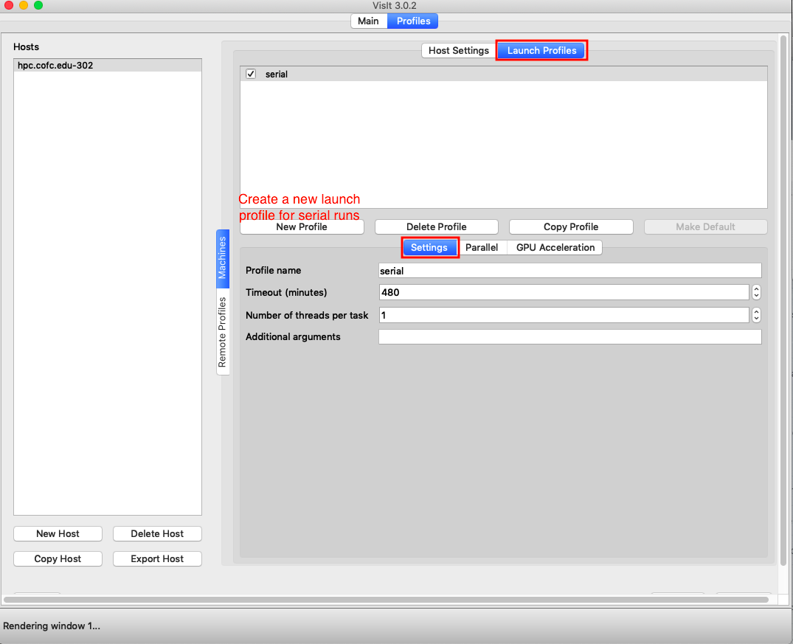
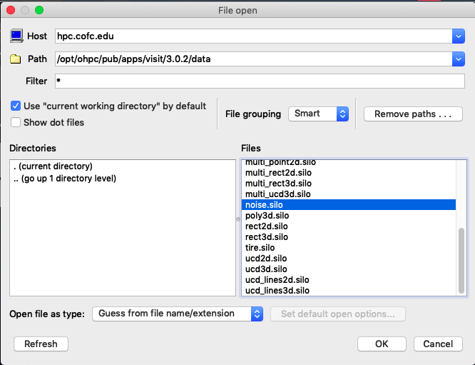
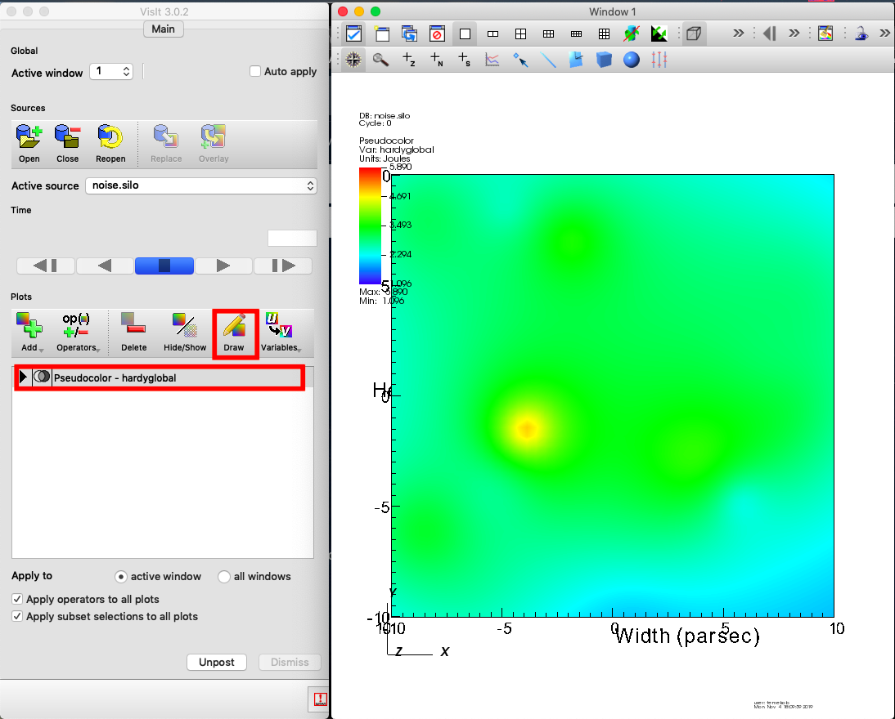

# Visualize Data

## SUMMARY

### The Data

Data produced from your calculations comes in many different forms such as [\[1\]](https://www.chpc.utah.edu/presentations/images-and-pdfs/SCIVisHPC.pdf)

* Typically continuous fields –
  * Scalar, vector, tensor –2D, 3D, 2.5D 
* Geometry \(“topology”\) 
  * Structured \(finite differences\) –
  * Unstructured 
    * Tet, hex meshes \(finite elements\) 
    * Particles -- n-body simulations \(molecular dynamics, cosmology, blood flow\) 
    * AMR
  * Other \(spectral / functional / wavelet\) •
    * DFT, FMM, DNS 
    * Usually generate large structured data as postprocess

### The Visualizations 

This data can be visualized as 

* Linear or curved scalar plots
* Pseudocolors
* Isocontours
* Isosurfaces
* Volume renderings
* Vector flows
* Molecular visualizations

### The Tools

There are a lot of software that are specifically designed for research computing platforms. That means the ability to handle remote visualization, do parallel processing of data, recognize parallel data formats and render graphics remotely or locally. Here is a list of the most common ones:

* [VTK](http://www.vtk.org)
* [ParaView](http://www.paraview.org)
* [VisIT](http://visit.llnl.gov)
* [VisUS](https://wiki.visus.org/index.php/ViSUS_Viewer)

## ParaView

ParaView is powerful and versatile an open-source multiple-platform application for interactive, scientific visualization. It has a client–server architecture to facilitate remote visualization of datasets, and generates level of detail models to maintain interactive frame rates for large datasets.[\[2\]](https://www.paraview.org/)

We have ParaView 5.70 server running on the HPC and users would need to download and install the same version of ParaView on their local computer: [https://www.paraview.org/download/](https://www.paraview.org/download/)

For those needing to learn more about ParaView, there is a good tutorial [here](http://www.bu.edu/tech/support/research/training-consulting/online-tutorials/paraview/#INTRO) and another one here.

```text
<Servers>
<Server name="CofCHPC-ParaView-570" resource="cs://localhost:11111">
    <CommandStartup>
      <Options>
        <Option name="SSH_USER" label="SSH Username" save="true">
          <String default="test-user" />
        </Option>
        <Option name="SSH_EXE" label="SSH Executable" save="true">
          <File default="ssh" />
        </Option>
      </Options>
      <Command exec="$SSH_EXE$" delay="5">
        <Arguments>
          <Argument value="-L11111:hpc.cofc.edu:11111" /> <!-- port forwarding -->
          <Argument value="hpc.cofc.edu" />
          <Argument value="-l" />
          <Argument value="$SSH_USER$" />
          <Argument value="/opt/ohpc/pub/apps/paraview/5.7.0/pvserver" />
        </Arguments>
      </Command>
    </CommandStartup>
</Server>
</Servers>
```

## VisIT

You can run VisIT locally on your computer to visualize local data, remotely on the HPC cluster to visualize data stored on the HPC, or set it up in client-server mode to visualize data stored on the HPC cluster from your local computer. This is especially useful when you are dealing with large amounts of data being generated on the cluster and you want to do some analysis without having to download all that data to your local computer.

### Initial Client-Server Setup

To start VisIT in client-server mode, follow these steps

* Download and install LLNL VisIT if you don't have it already 
  1. [https://wci.llnl.gov/simulation/computer-codes/visit/executables](https://wci.llnl.gov/simulation/computer-codes/visit/executables)
  2. Please note that the man version number of VisIT on your local computer and HPC cluster need to match. That is, if the server version running on the HPC cluster is 2.x, the client version on your local computer also needs to be 2.x. In our case, we have versions 2.13.2 and 3.02 on the HPC cluster, so you can need to pick a particular version that matches one of these two.
* Open VisIT
* Go to '**Options&gt;Host Profiles**' in the top menu
* Create a new 'Host Setting' and a corresponding serial 'Launch Profile' as shown below. At the moment, only serial versions of VisIT have been tested to work. 




* When you are finished, go to '**Options&gt;Save Settings'** to save your current settings. Check to see they are preserved when you restart VisIT again.

###  Actual Runs

For actual VisIT local visualization of data stored remotely on the HPC cluster, you can follow these steps.

* Open VisIT on your local computer
* Go to the 'File' menu and select 'Open file'
* In window that opens, select '`hpc.cofc.edu`' for the host. You should be prompted to enter your HPC password or SSH key passphrase for authentication


*  You can consequently proceed to load up and visualize your data. As an example, let's open some sample data stored at `/opt/ohpc/pub/apps/visit/3.0.2/data`. We will open a file named `noise.silo`, and see if we can visualize it.
* Navigate to `/opt/ohpc/pub/apps/visit/3.0.2/data` and select `'noise.silo'`



* In the Main menu, go to the '`Plots`' section, click on '`Add +`' and select '`Pseudocolor > hardyglobal`'. 


 

* If a plot is not generated automatically, please click on the '`Draw`' button. If everything configured properly, you should see a plot like this:




### Configuration files

Instead of inputting the host and launch profiles manually, you can also read in the following configuration files or put them in `~/.visit/hosts` on your local computer.





## Remote Desktop  


Find more about that [here](https://hpc-cofc.gitbook.io/docs/using-the-hpc/access-hpc/gui-remote-desktop)



